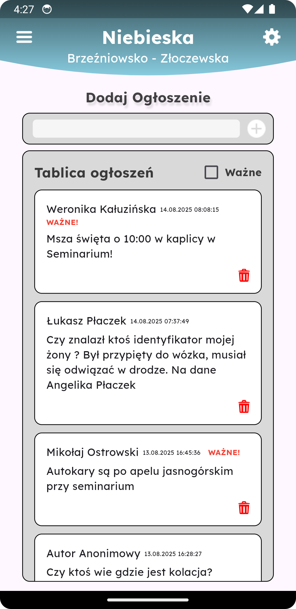
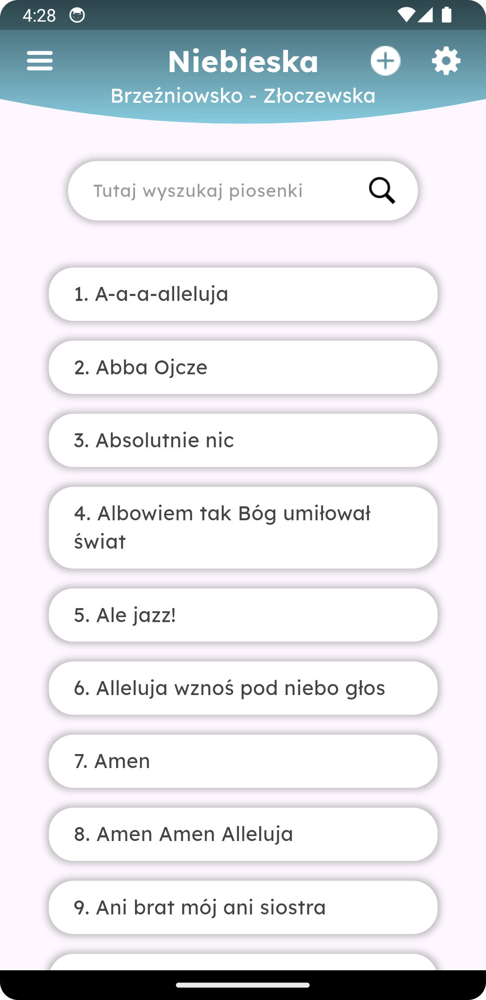
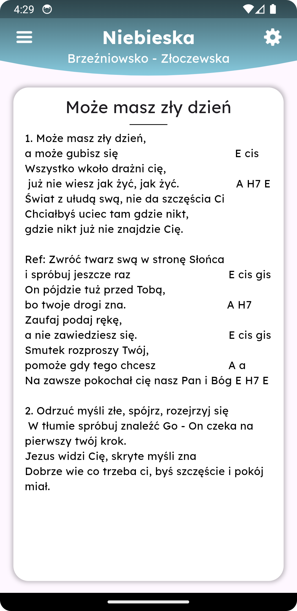

# 📱 Pelgrim

Pelgrim is a mobile app built with **Flutter**.  
The app is designed to help users organize and track their pilgrimages with simple and intuitive tools.

---

## 🚀 Features

- ✅ User authentication (login & registration)
- ✅ Manage tasks and pilgrimage schedules
- ✅ Clean and responsive Flutter UI
- ✅ Cross-platform support (Android & iOS & Web)

---

## 🛠️ Tech Stack

- Flutter
- Dart
- Firebase

---

## ▶️ Getting Started

To run this project locally:

1. Clone the repo:

   ```bash
   git clone https://github.com/kuba122388/Pelgrim.git
   ```

2. Go into the project folder:

   ```bash
   cd Pelgrim
   ```

3. Install dependencies:

   ```bash
   flutter pub get
   ```

4. Run the app:

   ```bash
   flutter run
   ```

> Make sure you have **Flutter SDK** installed and a working Android/iOS device or emulator.

---

## 📸 Screenshots
<div align="center">

<p float="left">
  
  
</p>

<p float="left">
  
  
</p>

</div>

---

## 📌 Future Improvements

- [ ] Improve UI/UX with animations and transitions
- [ ] Add offline mode / caching
- [ ] Better state management

---

## 🤝 Contributing

Contributions are welcome!  
Feel free to fork this project, open an issue, or submit a pull request.

---